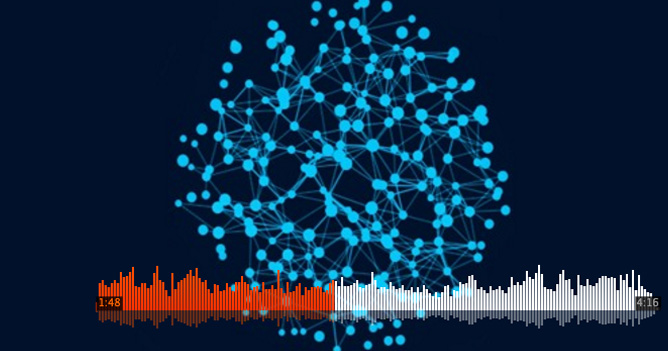

# AI Composer


Can AI compose music? This repo contains code that uses LSTM to generate music.

## Music Generated
| Title       | Soundtrack  | Music Sheet |
| ------------------ |---------------- | -------------- |
| Song #1  |[audio](https://youtu.be/_klcRx61xO4)|[pdf](https://drive.google.com/file/d/1mSyXggpy0btoLSkP0Bfk1Wr3L7VDbD9W/view?usp=sharing)      |
| Song #2  |[audio](https://youtu.be/y9gH0Zg4WZk)|[pdf](https://drive.google.com/file/d/1llE5zcu09FEKQW-Roes8Hxfq45oAF232/view?usp=sharing)      |
| Song #3  |[audio](https://youtu.be/pTB6eP2VTQA)|[pdf](https://drive.google.com/file/d/1hojev8zJbceeRrc4TAaN6jQtu7dE76bU/view?usp=sharing)      |
| Song #4 |[audio](https://youtu.be/4-Uk61gyPHA)|[pdf](https://drive.google.com/file/d/1cby4REE5XCTsPggfAQV5J20twqzsn2Ui/view?usp=sharing)      |

## Requirements
To install requirements:
```
conda create -n music python=3.8
conda activate music
pip install -r requirements.txt
```

## Training
To train the model, run this command:
```
python LSTM_trainer.py
```


## Pre-trained Models
You can download pretrained models here:
- [model_pretrain.pt](model_pretrain.pt)

## Music Generation
To generate music, run this command:
```
python music_generation.py
```
Generated music will be save in `music_generated.txt` in abc format. Use http://mandolintab.net/abcconverter.php to convert abc file to midi or pdf files. You can play midi file online at http://midiplayer.ehubsoft.net/.

## Collaboration
This project is collaborated with Steven and Eric.